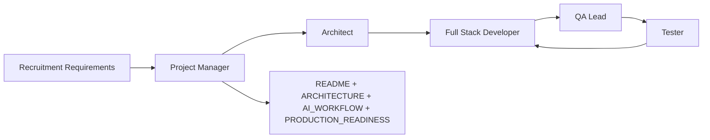

# AI Tracker — Agent Team

Multi-agent workflow for building the **Client Issue Tracker** take-home assessment.

## How to use

Invoke an agent by naming it in Cursor chat, e.g.:

- `@recruitment-requirements` — check spec compliance
- `@architect-agent` — design API, DB, folder structure
- `@project-manager-agent` — plan phases, track scope
- `@fullstack-developer-agent` — implement features
- `@qa-lead-agent` — define test strategy and acceptance criteria
- `@tester-agent` — run manual/automated test checklists
- `@ui-designer-agent` — Pixel Future UI components and layouts
- `@documentation-agent` — README, ARCHITECTURE, AI_WORKFLOW, PRODUCTION_READINESS

Skills live in `.cursor/skills/<agent-name>/SKILL.md`.

---

## Agent roster

| Agent                          | Skill path                                  | Primary responsibility                                              |
| ------------------------------ | ------------------------------------------- | ------------------------------------------------------------------- |
| **Recruitment / Requirements** | `.cursor/skills/recruitment-requirements/`  | Source of truth for assessment spec; trace features to requirements |
| **Architect**                  | `.cursor/skills/architect-agent/`           | System design, Prisma schema, API contracts, monorepo layout        |
| **Project Manager**            | `.cursor/skills/project-manager-agent/`     | Phasing, scope control, deliverables checklist, time budget (6–8h)  |
| **Full Stack Developer**       | `.cursor/skills/fullstack-developer-agent/` | React (Vite) + Express + PostgreSQL implementation                  |
| **QA Lead**                    | `.cursor/skills/qa-lead-agent/`             | Test plans, acceptance criteria, role-based scenarios               |
| **Tester**                     | `.cursor/skills/tester-agent/`              | Execute test cases, regression checks, bug reports                  |
| **UI Designer**                | `.cursor/skills/ui-designer-agent/`         | Pixel Future layouts, Tailwind components, UX patterns              |
| **Documentation**              | `.cursor/skills/documentation-agent/`       | Assessment markdown deliverables and submission copy                |

---

## Recommended workflow

### Phase 0 — Align

1. **Recruitment agent** — confirm scope against [docs/REQUIREMENTS.md](docs/REQUIREMENTS.md)
2. **PM agent** — break work into phases; flag must-have vs nice-to-have

### Phase 1 — Design

3. **Architect agent** — monorepo structure, Prisma schema, REST API map, auth approach

### Phase 2 — Build

4. **Developer agent** — scaffold `client/` + `server/`, implement features per requirements

### Phase 3 — Verify

5. **QA Lead** — acceptance criteria per role (Client / Manager)
6. **Tester** — run checklist; file issues for Developer

### Phase 4 — Ship

7. **PM + Developer** — docs, screenshots, demo credentials, submission checklist

---

## Confirmed project constraints

| Area          | Choice                                                                  |
| ------------- | ----------------------------------------------------------------------- |
| Frontend      | React 18 + Vite + TypeScript + React Router                             |
| Backend       | Node.js + Express + TypeScript                                          |
| Database      | PostgreSQL + Prisma                                                     |
| Design        | Pixel Future palette (see [docs/REQUIREMENTS.md](docs/REQUIREMENTS.md)) |
| Auth          | Mock role-based (Client / Manager), documented                          |
| Monitoring    | Mock website status acceptable                                          |
| Notifications | In-app (mock email documented)                                          |
| AI            | Optional in-app suggest + AI_WORKFLOW.md for Cursor usage               |

---

## Deliverables tracker

- [x] Monorepo scaffold (`client/`, `server/`)
- [x] Authentication (Client + Manager)
- [x] Website dashboard
- [x] Issue reporting + management + assignment
- [x] Issue timeline (activity_logs)
- [x] Notifications on resolve
- [x] Manager analytics dashboard
- [x] AI suggest / summary / response endpoints
- [x] README.md, ARCHITECTURE.md, AI_WORKFLOW.md, PRODUCTION_READINESS.md
- [x] API_SPEC.md, DATABASE_SCHEMA.md, TEST_PLAN.md
- [ ] Screenshots of key workflows (capture after running app)

---

## Key documents

- [docs/REQUIREMENTS.md](docs/REQUIREMENTS.md) — full recruitment spec
- [.cursor/rules/project-stack.mdc](.cursor/rules/project-stack.mdc) — stack and design tokens
